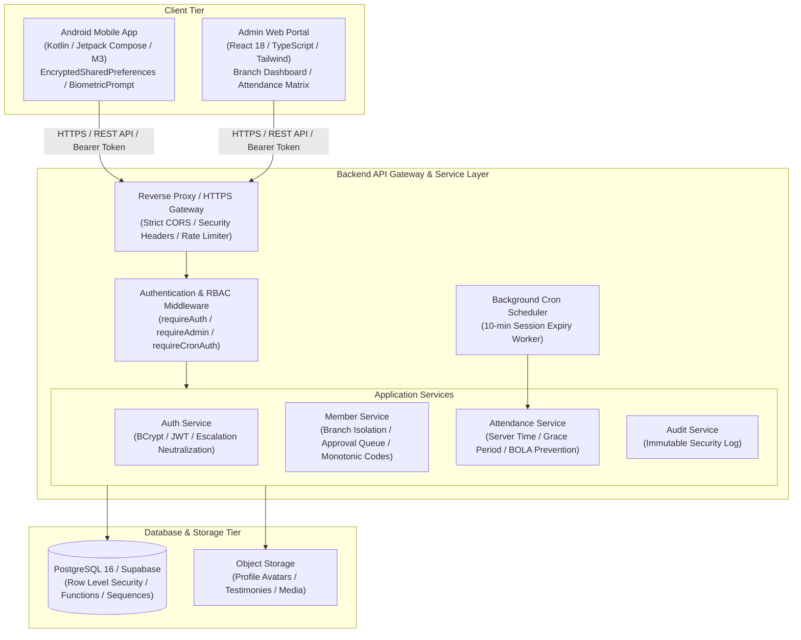
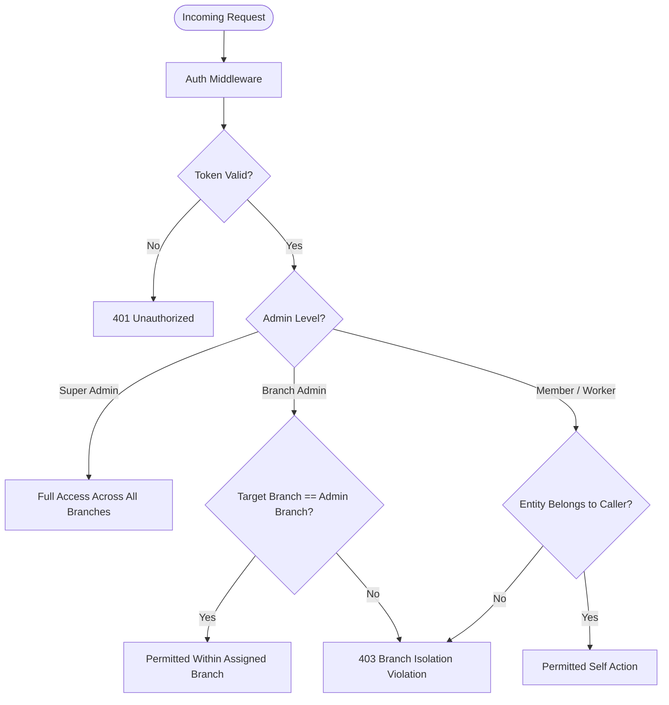
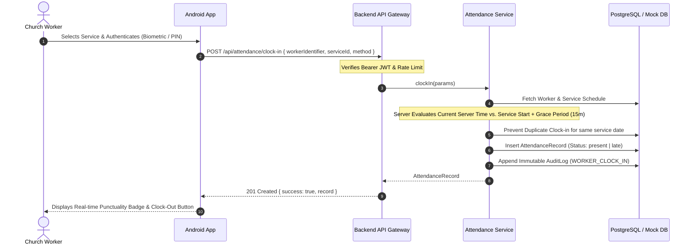

# FPM ONE — Enterprise System Architecture Documentation

**Platform:** Faith Preachers Ministry (FPM ONE)  
**Version:** 1.0.0 (Production Hardened)  
**Author:** Principal Software Architect  
**Audience:** Engineering Team, Cloud Operations, Security Auditors  

---

## 1. System Overview

**FPM ONE** is an enterprise-grade digital church management platform engineered to support Faith Preachers Ministry's global operations across multiple branches, departments, workers, and thousands of congregants.

### Key Architectural Tenets
1. **Server-Authoritative Business Logic:** Attendance punctuality, clock-in/out calculations, worker code generation, and approval workflows are computed exclusively on the server. No client timestamps or client-supplied privileges are trusted.
2. **Strict Multi-Branch Isolation:** Branch administrators are strictly scoped to their assigned chapter. Global headquarters administrators retain cross-branch visibility.
3. **Defense-in-Depth:** Hardened at the Android Keystore layer, API routing/middleware layer, controller validation layer, service layer, and the database Row Level Security (RLS) and stored procedure layers.
4. **Resilient Data Integrity:** Atomic sequence generators for worker IDs, unique constraints on attendance sessions, and immutable audit logging.

---

## 2. High-Level Architecture Diagram



---

## 3. Tier Responsibilities & Boundaries

### 3.1 Client Tier

#### Android Mobile Application (`org.fpm.one`)
- **UI Stack:** Modern Jetpack Compose, Material 3, dynamic theme switching (Light/Dark).
- **Navigation:** Multiplatform-ready Navigation3 with type-safe route destinations.
- **Local Data & Credential Security:**
  - JWT authentication tokens and cached user sessions are protected using **`EncryptedSharedPreferences`** backed by **`MasterKey` (AES256-GCM / AES256-SIV)** via the Android Keystore hardware security module.
  - Zero plaintext credential leakage on rooted or inspected devices.
- **Biometric Integration:**
  - Android `BiometricPrompt` framework handles local worker authentication without exposing raw biometrics to network calls.
  - Upon successful local biometric challenge, server sends authoritative clock-in request signed with session token.
- **Offline / Caching Resilience:**
  - Safe local cache for user session and church announcements to enable rapid app launch.

#### Admin Web Portal (`admin-portal/`)
- **UI Stack:** React 18, TypeScript, Tailwind CSS, Lucide React icons, Vite 6.
- **Scoped Administrative Views:**
  - Renders contextual branch switcher for Super Administrators.
  - Branch Pastors are locked into their assigned branch view; cross-branch mutations are rejected by UI and API.
- **Operations Supported:**
  - Member Approvals Queue (Approve, Reject with Reason, Request Changes).
  - Church Directory (Search, Department & Role assignments, Status toggles).
  - Live Attendance Monitor & Monthly Grid Matrix with CSV export.
  - Testimonies Pastoral Review & Feed Moderation.
  - Push Notification Broadcast & System Audit Trail Inspector.

---

### 3.2 Backend Service & API Tier (`backend/`)

The backend follows a modular, layered architecture:

```
backend/src/
├── controllers/       # HTTP Request/Response marshalling, parameter validation
│   └── apiControllers.ts
├── data/              # In-memory mock database & monotonic sequence store
│   └── mockDb.ts
├── middleware/        # Security, authentication, and branch validation
│   └── authMiddleware.ts
├── routes/            # Route mounting and URL hierarchy
│   └── api.ts
├── services/          # Core domain logic, invariants, and calculations
│   ├── attendanceService.ts
│   ├── auditService.ts
│   ├── authService.ts
│   └── memberService.ts
├── types/             # TypeScript domain models and contracts
│   └── index.ts
└── server.ts          # Express initialization, security headers, rate limiting, cron
```

#### Key Architecture Guarantees:
1. **Separation of Concerns:** Controllers extract HTTP input and pass caller security contexts into Services; Services encapsulate all business logic and invariants.
2. **Rate Limiting & Threat Mitigation:** Sliding-window rate limiters defend authentication routes (`/api/auth/login`, `/api/auth/register`) and clock-in endpoints (`/api/attendance/clock-in`).
3. **HTTP Response Hardening:** Standard headers prevent MIME sniffing, frame clickjacking, and script injection (`X-Content-Type-Options: nosniff`, `X-Frame-Options: DENY`, `Strict-Transport-Security`, `Content-Security-Policy`).

---

### 3.3 Database & Stored Procedure Tier (`backend/database/`)

#### Relational Data Model
- **Organizations -> Branches -> Departments -> Workers -> Attendance Records**.
- **Users -> Members -> Ministry Roles**.
- **Services -> Attendance Records**.

#### Database-Level Security Controls:
1. **Row Level Security (RLS):**
   - RLS is enabled on all sensitive tables (`members`, `workers`, `attendance_records`, `audit_logs`).
   - Branch admins can only select or update rows matching their branch ID (`primary_branch_id = current_setting('app.current_branch_id')`).
2. **Atomic Sequences:**
   - PostgreSQL sequence `worker_id_seq` generates monotonic worker codes (`FPM-0001`, `FPM-0002`).
   - Unique constraints prevent duplicate codes (`UNIQUE (worker_id_code)`).
3. **Server Stored Procedures:**
   - `record_worker_clock_in()`: Validates worker status, checks duplicate clock-ins, calculates punctuality (Present vs. Late) using `NOW()`.
   - `record_worker_clock_out()`: Enforces prior clock-in, computes elapsed duration in minutes, sets manual or automatic source.
   - `auto_clock_out_expired_sessions()`: Scans active sessions exceeding duration limit (default 4 hours) and marks them automatically.
   - `mark_service_absences()`: Inserts `absent` records for active branch workers who missed a scheduled service.

---

## 4. Multi-Branch Isolation Architecture



- **Headquarters / Super Admin:** Holds global visibility across all branches (Cathedral HQ, Lekki, London, Houston).
- **Branch Pastor:** Strictly constrained to members, workers, departments, services, and attendance of their designated branch. Attempted mutations of foreign branch IDs fail with `403 Branch isolation violation`.
- **Member / Worker:** Object-level access restricted to own profile, own QR token, and own attendance sessions (BOLA prevention).

---

## 5. Authoritative Attendance Flow



---

## 6. Audit Trail & Compliance

Every sensitive action in the system generates an audit record storing:
- **`actorName` & `actorRole`**: Identifying who performed the action.
- **`action`**: e.g., `MEMBER_APPROVED`, `MEMBER_REJECTED`, `WORKER_CLOCK_IN`, `ATTENDANCE_EXCUSED`.
- **`targetType` & `targetId`**: Entity affected.
- **`previousState` & `newState`**: JSON diff for full accountability.
- **`timestamp`**: Authoritative UTC timestamp.

Audit records are append-only; update and delete operations are forbidden by design.
